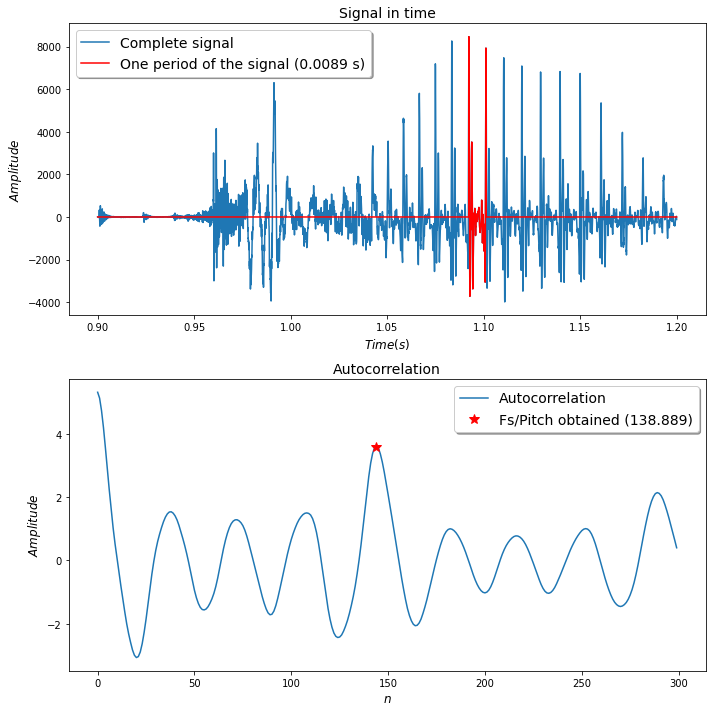
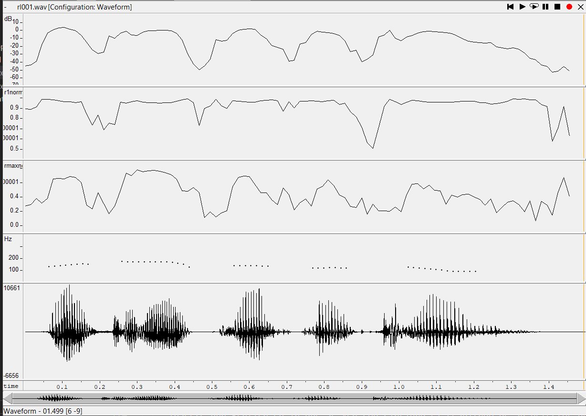
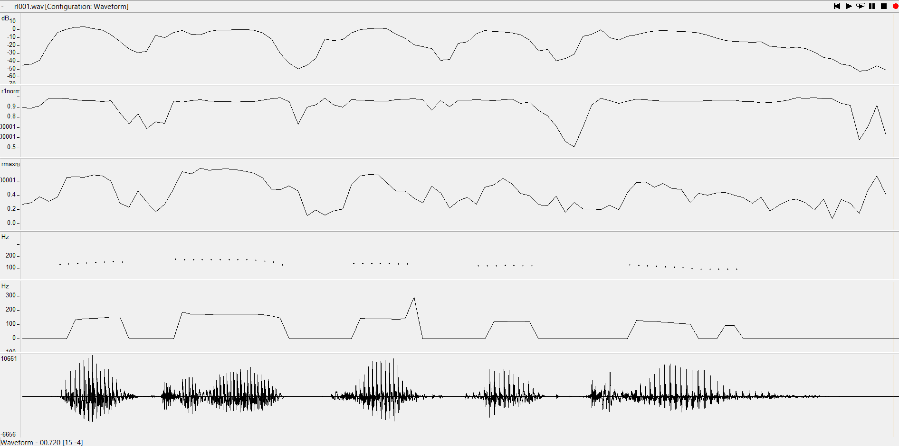
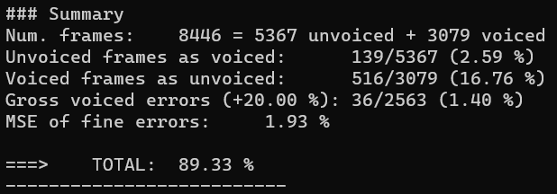
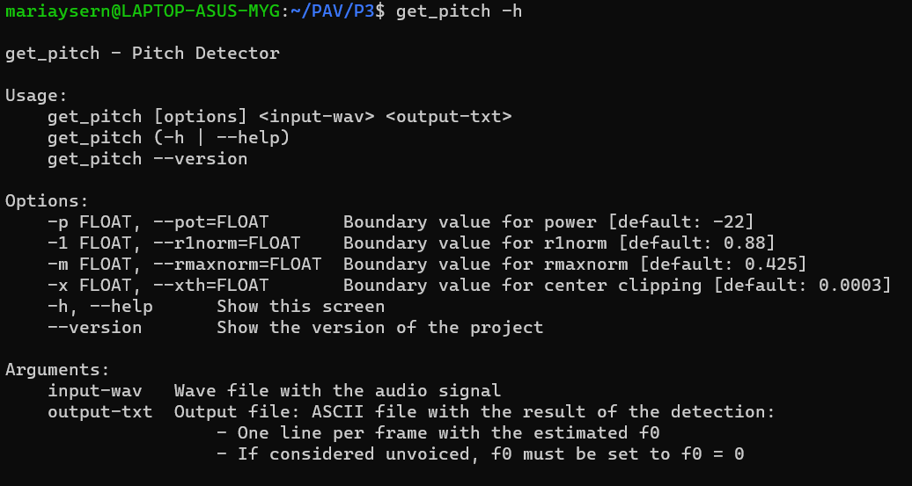
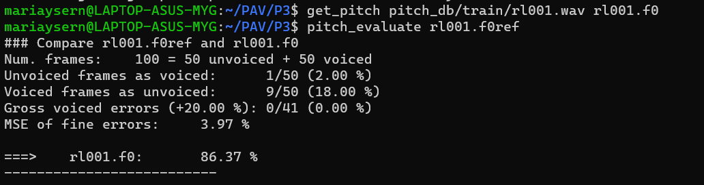
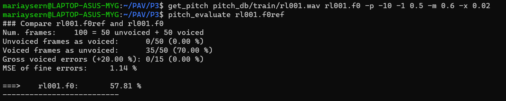
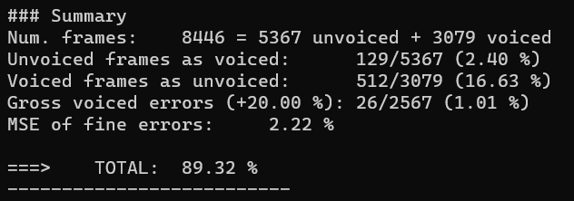

PAV - P3: detección de pitch
============================

Esta práctica se distribuye a través del repositorio GitHub [Práctica 3](https://github.com/albino-pav/P3).
Siga las instrucciones de la [Práctica 2](https://github.com/albino-pav/P2) para realizar un `fork` de la
misma y distribuir copias locales (*clones*) del mismo a los distintos integrantes del grupo de prácticas.

Recuerde realizar el *pull request* al repositorio original una vez completada la práctica.

Ejercicios básicos
------------------

- Complete el código de los ficheros necesarios para realizar la detección de pitch usando el programa
  `get_pitch`.

   * Complete el cálculo de la autocorrelación e inserte a continuación el código correspondiente.

   > El código de la autocorrelación es:
   >
   > ```cpp
   > void PitchAnalyzer::autocorrelation(const vector<float> &x, vector<float> &r) const {
   > 
   >    for (unsigned int l = 0; l < r.size(); ++l) {
   >      /// \TODO Compute the autocorrelation r[l]
   >      /// \DONE Autocorrelation *computed*
   >      /// - r[l] = sumatorio de n = l a x.size() de x[n] * x[n-l];
   >      r[l] = 0;
   >      for(unsigned int n = l; n < x.size(); n++){
   >        r[l] += x[n] * x[n - l];
   >      }
   >    }
   > 
   >     if (r[0] == 0.0F) //to avoid log() and divide zero 
   >       r[0] = 1e-10; 
   > }
	 > ```

   * Inserte una gŕafica donde, en un *subplot*, se vea con claridad la señal temporal de un segmento de
     unos 30 ms de un fonema sonoro y su periodo de pitch; y, en otro *subplot*, se vea con claridad la
	 autocorrelación de la señal y la posición del primer máximo secundario.

	 NOTA: es más que probable que tenga que usar Python, Octave/MATLAB u otro programa semejante para
	 hacerlo. Se valorará la utilización de la librería matplotlib de Python.

   > Se ha escogido la séptima trama del audio 'rl001.wav' (de la base de entrenamiento) ya que es en gran parte sonora:
   >
   > 
   >
   > Se puede comprobar que el primer máximo secundario concuerda con el valor de la frecuencia de muestreo entre el pitch (marcado con en rojo en el segundo *subplot*).
   >
   > Estas gráficas se han programado con Python. Este es el código:
   >
   > ```py
   > # Imports necessarios
   > import numpy as np
   > import matplotlib as mpl
   > import matplotlib.pyplot as plt
   > from scipy.io import wavfile as wav
   > 
   > # Abrir los ficheros
   > audio_filename = 'rl001.wav'
   > correlation_filename = 'autocorreletion.txt'
   > fs, data_audio = wav.read(audio_filename)
   > data_corr = np.loadtxt(correlation_filename, delimiter='\t', skiprows=0,)
   > 
   > # Queremos representar la séptima trama ya que sabemos que es sonora
   > tin = int(0.15*6*fs)
   > tfin = int((0.15*6+0.3)*fs)
   > t = np.zeros(tfin-tin)
   > for i in range(tfin-tin):
   >   t[i] = 0.15*6 + i*0.3/(tfin-tin)
   > 
   > # Para marcar un periodo de la señal
   > data_pitch = np.zeros(tfin-tin)
   > data_pitch[3846:4024] = data_audio[21846:22024]
   > plot_audio = plt.subplot(211)
   > plot_audio.plot(t, data_audio[tin:tfin], label='Complete signal')
   > plot_audio.plot(t, data_pitch, 'r', label='One period of the signal (0.0089 s)')
   > plot_audio.set_xlabel("$Time (s)$", fontsize=12)
   > plot_audio.set_ylabel("$Amplitude$", fontsize=12)
   > plot_audio.set_title("Signal in time", fontsize=14)
   > plot_audio.legend(loc='upper left', shadow=True, fontsize=14)
   > plot_corr = plt.subplot(212)
   > plot_corr.plot(data_corr[6,:], label='Autocorrelation')
   > plot_corr.plot(fs/138.889,3.6,'r*',markersize=10, label='Fs/Pitch obtained (138.889)')
   > plot_corr.set_xlabel("$n$", fontsize=12)
   > plot_corr.set_ylabel("$Amplitude$", fontsize=12)
   > plot_corr.set_title("Autocorrelation", fontsize=14)
   > plot_corr.legend(loc='upper right', shadow=True, fontsize=14)
   > plt.tight_layout()
   > plt.show()
   > ```

   * Determine el mejor candidato para el periodo de pitch localizando el primer máximo secundario de la
     autocorrelación. Inserte a continuación el código correspondiente.

   > El código de para buscar el pitch de una trama consiste en encontrar la diferencia (lag) entre el origen y el primer máximo secundario de la autocorrelación. Si la trama es no sonora, no tiene sentido devolver ningún valor, así que se retorna un 0. En cambio, si es sonora se devuelve el pitch: frecuencia de muestreo/lag. El código empleado es:
   >
   > ```cpp
   > float PitchAnalyzer::compute_pitch(vector<float> & x) const {
   >     if (x.size() != frameLen)
   >       return -1.0F;
   > 
   >     //Window input frame
   >     for (unsigned int i=0; i<x.size(); ++i)
   >       x[i] *= window[i];
   > 
   >     vector<float> r(npitch_max);
   > 
   >     //Compute correlation
   >     autocorrelation(x, r);
   > 
   >     vector<float>::const_iterator iR = r.begin(), iRMax = iR + npitch_min;
   > 
   >     /// \TODO 
   > 	/// Find the lag of the maximum value of the autocorrelation away from the origin.<br>
   > 	/// Choices to set the minimum value of the lag are:
   > 	///    - The first negative value of the autocorrelation.
   > 	///    - The lag corresponding to the maximum value of the pitch.
   >     ///	   .
   > 	/// In either case, the lag should not exceed that of the minimum value of the pitch.
   >     /// \DONE
   >   /// Se busca el lag entre los valores mínimo y máximo de pitch.
   > 
   >     for(iR = r.begin() + npitch_min; iR < r.begin() + npitch_max; iR++){
   >       if(*iR > *iRMax){
   >         iRMax = iR;
   >       }
   >     }
   > 
   >     unsigned int lag = iRMax - r.begin();
   > 
   >     float pot = 10 * log10(r[0]);
   > 
   >     //You can print these (and other) features, look at them using wavesurfer
   >     //Based on that, implement a rule for unvoiced
   >     //change to #if 1 and compile
   > #if 1
   >     if (r[0] > 0.0F)
   >       cout << pot << '\t' << r[1]/r[0] << '\t' << r[lag]/r[0] << endl;
   > #endif
   >     
   >     if (unvoiced(pot, r[1]/r[0], r[lag]/r[0]))
   >       return 0;
   >     else
   >       return (float) samplingFreq/(float) lag;
   >   }
   > }
   > ```


   * Implemente la regla de decisión sonoro o sordo e inserte el código correspondiente.

   > Para implementar la regla de decisión, primero se ha representado una señal de prueba junto la potencia, la autocorrelación normalizada en 1 y la normalizada en el primer máximo secundario, tal como se muestra en la siguiente pregunta. Se ha visto que la **potencia** es útil para saber si el locutor está hablando pero no para detectar la sonoridad (por ejemplo el tramo entre 0.95 y 1 segundo es sordo pero la potencia es elevada). En cambio, las **autocorrelaciones** detectan bastante bien si el tramo es sonoro pero no si se está hablando (por ejemplo, a partir de los 4 segundos no hay voz pero sus valores son elevados). Por lo tanto, se debe buscar si uno de los tres valores es bajo para determinar que el tramo es sordo.
   >
   > El código es el siguiente:
   >
   > ```cpp
   > bool PitchAnalyzer::unvoiced(float pot, float r1norm, float rmaxnorm) const {
   >   /// \TODO Implement a rule to decide whether the sound is voiced or not.
   >   /// * You can use the standard features (pot, r1norm, rmaxnorm),
   >   ///   or compute and use other ones.
   >   /// \DONE Se ha usado una comninación de la potencia, la r1norm y la rmaxnorm
   > 
   >   if(r1norm<0.88 || rmaxnorm<0.445 || pot < -22)
   >     return true;
   >   return false;
   > }
   > ```

- Una vez completados los puntos anteriores, dispondrá de una primera versión del detector de pitch. El 
  resto del trabajo consiste, básicamente, en obtener las mejores prestaciones posibles con él.

  * Utilice el programa `wavesurfer` para analizar las condiciones apropiadas para determinar si un
    segmento es sonoro o sordo. 
	
	  - Inserte una gráfica con la detección de pitch incorporada a `wavesurfer` y, junto a ella, los 
	    principales candidatos para determinar la sonoridad de la voz: el nivel de potencia de la señal
		(r[0]), la autocorrelación normalizada de uno (r1norm = r[1] / r[0]) y el valor de la
		autocorrelación en su máximo secundario (rmaxnorm = r[lag] / r[0]).

		Puede considerar, también, la conveniencia de usar la tasa de cruces por cero.

	    Recuerde configurar los paneles de datos para que el desplazamiento de ventana sea el adecuado, que
		en esta práctica es de 15 ms.

    > La gráfica obtenida para el audio 'rl001.wav' es:
    >
    > 
    >
    > Podemos observar que ninguno de los tres candidatos por separado es un buen detector de sonoridad porque cuando uno falla otro acierta. Está más explicado en la pregunta anterior.

      - Use el detector de pitch implementado en el programa `wavesurfer` en una señal de prueba y compare
	    su resultado con el obtenido por la mejor versión de su propio sistema. Inserte una gráfica
		ilustrativa del resultado de ambos detectores.

    > La gráfica obtenida para el audio 'rl001.wav' es:
    >
    > 
    >
    > En general detecta bien la sonoridad y el pitch cuando corresponde pero hay algunas zonas (sobre los 1.15 segundos) que las detecta como no sonoras cuando no lo son y una donde ocurre lo contrario (sobre los 0.65 segundos) por lo que detecta una frecuencia que claramente no corresponde con el audio.
  
  * Optimice los parámetros de su sistema de detección de pitch e inserte una tabla con las tasas de error
    y el *score* TOTAL proporcionados por `pitch_evaluate` en la evaluación de la base de datos 
	`pitch_db/train`.

    > Los valores que indican que la trama es no sonora y con los que se ha conseguido mejor resultado son:
    >
    > - **Potencia** menor a -22 dB.
    >
    > - **Autocorrelación normalizada de 1** menor a 0.88
    >
    > - **Autocorrelación normalizada en su primer máximo secundario** menor a 0.425
    >
    > Si se cumple cualquiera de las tres condiciones se considera que la trama no es sonora. Las tasas de error conseguidas son:
    >
    > 

   * Inserte una gráfica en la que se vea con claridad el resultado de su detector de pitch junto al del
     detector de Wavesurfer. Aunque puede usarse Wavesurfer para obtener la representación, se valorará
	 el uso de alternativas de mayor calidad (particularmente Python).

   > Tal como se ha comentado en el ejircicio anterior en general son muy parecidas pero hay errores en nuestro detector:
   >
   > 
   >
   > El código usado para representar la comparación es:
   > ``` py
   > # Imports necessarios
   > import numpy as np
   > import matplotlib as mpl
   > import matplotlib.pyplot as plt
   > from scipy.io import wavfile as wav
   > 
   > # Abrir los ficheros
   > pitch_filename = 'rl001_results.txt'
   > pitch_wavesurfer_filename = 'rl001_wavesurfer.txt'
   > pitch = np.loadtxt(pitch_filename, skiprows=0,)
   > pitch_wavesurfer = np.loadtxt(pitch_wavesurfer_filename, skiprows=0,)
   > 
   > # Crear vector temporal (entre cada muestra hay 15 ms)
   > t = np.zeros(len(pitch))
   > for i in range(len(pitch)):
   >   t[i] = 0.015*i
   > 
   > # Representar las dos señales
   > plt.plot(t, pitch, 'b', label="Pitch detector")
   > plt.plot(t, pitch_wavesurfer, 'r', label="Wavesurfer detector")
   > plt.xlabel("$Time (s)$", fontsize=12)
   > plt.ylabel("$Frequency (Hz)$", fontsize=12)
   > plt.title("Results of both pitch detectors", fontsize=14)
   > plt.legend(loc='upper right', shadow=True, fontsize=14)
   > plt.show()
   > ```

Ejercicios de ampliación
------------------------

- Usando la librería `docopt_cpp`, modifique el fichero `get_pitch.cpp` para incorporar los parámetros del
  detector a los argumentos de la línea de comandos.
  
  Esta técnica le resultará especialmente útil para optimizar los parámetros del detector. Recuerde que
  una parte importante de la evaluación recaerá en el resultado obtenido en la detección de pitch en la
  base de datos.

  * Inserte un *pantallazo* en el que se vea el mensaje de ayuda del programa y un ejemplo de utilización
    con los argumentos añadidos.

   > El mensaje de ayuda del programa es:
   >
   > 
   >
   > Se pueden escoger los umbrales para el center clipping y para la decisión de sonoridad de la trama (potencia en dB, autocorrelación en 1 y autocorrelación en el primer máximo secundario).
   > 
   > Un ejemplo sin utilizar los parámetros:
   >
   > 
   >
   > Un ejemplo utilizando los parámetros:
   >
   > 
   >

- Implemente las técnicas que considere oportunas para optimizar las prestaciones del sistema de detección
  de pitch.

  Entre las posibles mejoras, puede escoger una o más de las siguientes:

  * Técnicas de preprocesado: filtrado paso bajo, *center clipping*, etc.
  * Técnicas de postprocesado: filtro de mediana, *dynamic time warping*, etc.
  * Métodos alternativos a la autocorrelación: procesado cepstral, *average magnitude difference function*
    (AMDF), etc.
  * Optimización **demostrable** de los parámetros que gobiernan el detector, en concreto, de los que
    gobiernan la decisión sonoro/sordo.
  * Cualquier otra técnica que se le pueda ocurrir o encuentre en la literatura.

  Encontrará más información acerca de estas técnicas en las [Transparencias del Curso](https://atenea.upc.edu/pluginfile.php/2908770/mod_resource/content/3/2b_PS%20Techniques.pdf)
  y en [Spoken Language Processing](https://discovery.upc.edu/iii/encore/record/C__Rb1233593?lang=cat).
  También encontrará más información en los anexos del enunciado de esta práctica.

  Incluya, a continuación, una explicación de las técnicas incorporadas al detector. Se valorará la
  inclusión de gráficas, tablas, código o cualquier otra cosa que ayude a comprender el trabajo realizado.

  También se valorará la realización de un estudio de los parámetros involucrados. Por ejemplo, si se opta
  por implementar el filtro de mediana, se valorará el análisis de los resultados obtenidos en función de
  la longitud del filtro.

  > En el detector se ha incluido una técnica de preprocesado y otra de postprocesado para optimizar el sistema. Como técnica de preprocesado se ha implementado el *center clipping* con offset, que consiste en anular los valores los valores de la señal menores a un cierto umbral. Con esto se consigue eliminar la cola reverberante de la voz, aumentar la robustez frente al ruido y, como es con offset, la función de transformación es continua. Para escoger el valor del umbral, 'xth', se ha añadido una opción en el docopt que por defecto es 0.0003.
  >
  > El código es:
  >
  > ```cpp
  > for (unsigned int i = 0; i < x.size(); i++){
  >   if (x[i] > xth)
  >     x[i] = x[i] - xth;
  >   else if (x[i] < -1 * xth)
  >     x[i] = x[i] + xth;
  >   else
  >     x[i] = 0;
  > }
  > ```
  >
  > Como técnica de postprocesado se ha implementado el filtro de mediana de longitud 3. Con este filtrado se consigue eliminar los valores atípicos de pitch, es decir disminuir los *gross errors*. Esta es una comparación entre el pitch conseguido para una trama con y sin el filtro:
  >
  > 
  >
  > Se puede ver como se han corregido los errores y ahora se parece más a la gráfica del detector de 'wavesurfer'.
  >
  > El código es:
  >
  > ```cpp
  > for (unsigned int i = 1; i < f0.size()-1; i++){
  >   vector<float> aux;
  >   aux.push_back(f0[i-1]);
  >   aux.push_back(f0[i]);
  >   aux.push_back(f0[i+1]);
  >   std::sort (aux.begin(), aux.end());
  >   f0[i] = aux[1];
  > }
  > ```
  >
  > Con estas mejoras se ha conseguido una puntuación del **89,32%**, un 0,01% menor que la obtenida sin las mejoras pero se ha disminuido los *gross voiced errors* en un 0,39%.
  >
  > 
   

Evaluación *ciega* del detector
-------------------------------

Antes de realizar el *pull request* debe asegurarse de que su repositorio contiene los ficheros necesarios
para compilar los programas correctamente ejecutando `make release`.

Con los ejecutables construidos de esta manera, los profesores de la asignatura procederán a evaluar el
detector con la parte de test de la base de datos (desconocida para los alumnos). Una parte importante de
la nota de la práctica recaerá en el resultado de esta evaluación.
